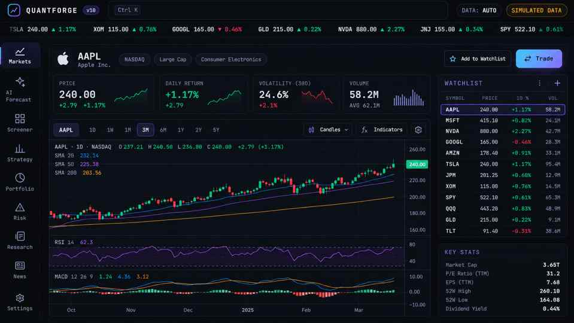
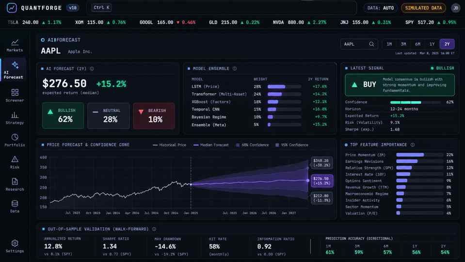
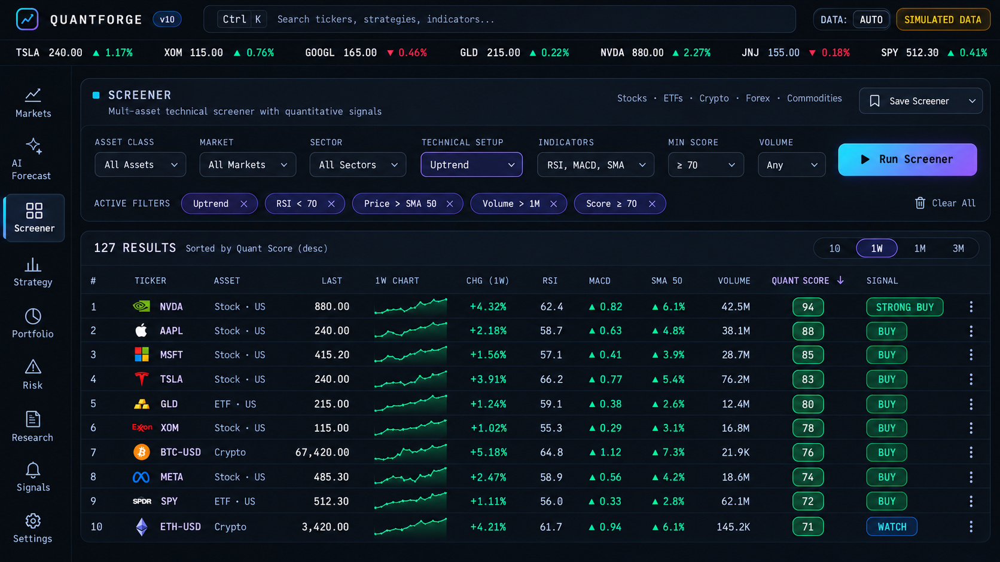
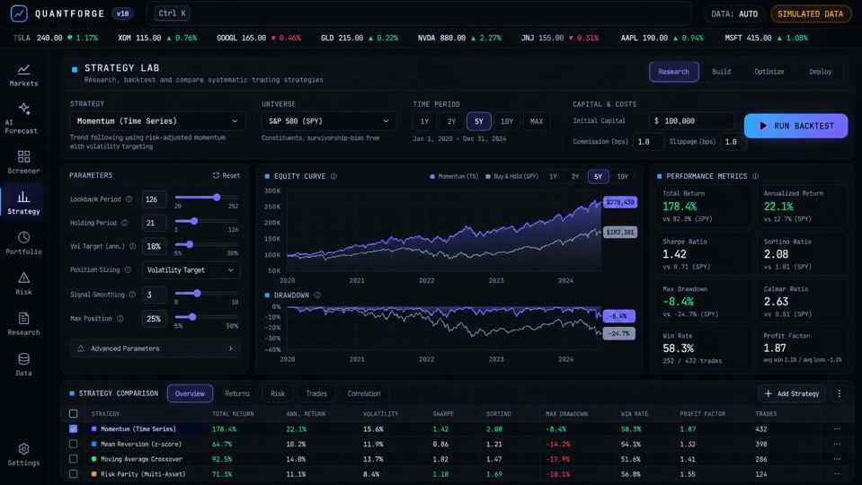
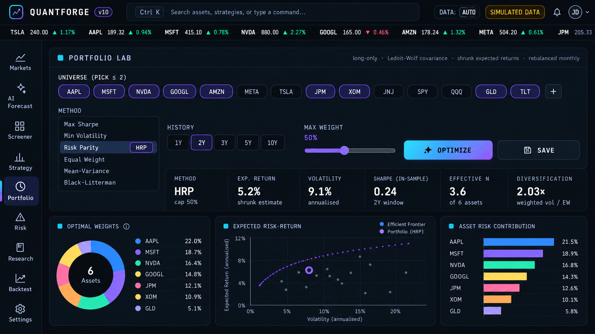
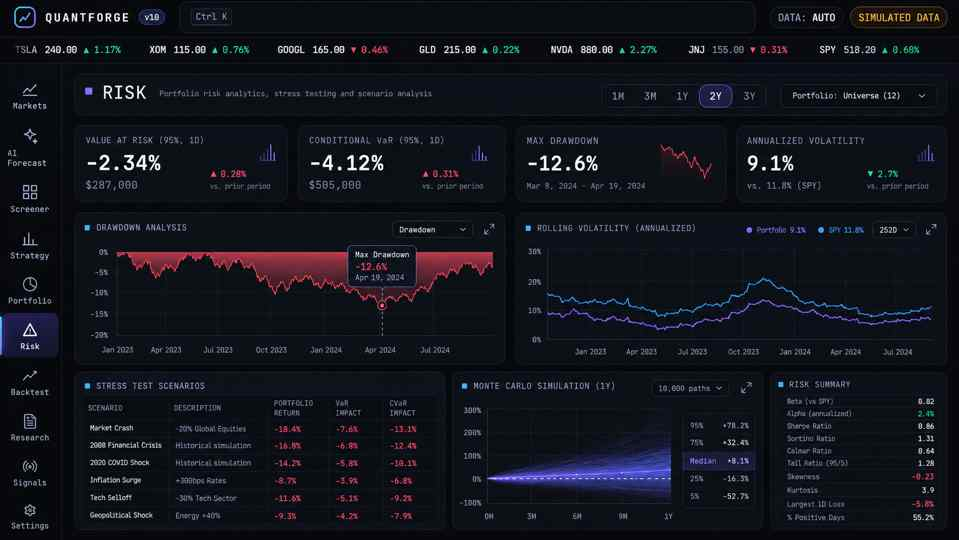

<div align="center">

# QuantForge v10
### Quantitative Research · Portfolio Engineering · Financial Machine Learning

**A research terminal for exploring markets, validating strategies and investigating risk.**

[Live Terminal](https://quantforge-v10.onrender.com) · [API Documentation](https://quantforge-v10.onrender.com/docs) · [Source Code](https://github.com/Edgar-50/QuantForge)


</div>

---

QuantForge unifies **market analytics, walk-forward ML forecasting, quantitative screening, strategy backtesting, multi-asset portfolio optimisation, scenario-based risk analysis, and options pricing** in one keyboard-driven workspace.

Built with a modular **FastAPI / numerical Python** backend and a responsive JavaScript interface, the platform prioritises reproducible experiments, realistic validation and clear separation between simulated and live data.

> **Research-only software:** QuantForge does not execute trades or offer investment advice. Model estimates and synthetic demonstrations do not establish an investable edge.

### Explore the platform

| Workspace | What it provides |
| --- | --- |
| **Markets** | OHLCV exploration, candlesticks, technical indicators, volatility and regime analysis |
| **AI Forecast** | Ensemble direction estimates, quantile forecast cones, walk-forward tests and model diagnostics |
| **Screener** | Ranked instrument universe with technical and momentum filters |
| **Strategy Lab** | Cost-aware systematic backtesting, signal inspection and in-sample/out-of-sample comparison |
| **Portfolio Lab** | Max Sharpe, minimum-volatility, risk parity and HRP allocation, constraints and holdout checks |
| **Risk Center** | VaR/CVaR, drawdowns, stress scenarios, rolling statistics and Monte Carlo |
| **Options Lab** | European and American pricing, Greeks, IV solving and multi-leg payoff research |

---

### Contents

[Platform capabilities](#v10-capabilities) · [Validation philosophy](#validation-philosophy) · [Architecture](#architecture) · [Data sources](#data-provider-chain) · [API](#api-v10) · [Run locally](#run-locally) · [Testing](#testing) · [Deployment](#deployment) · [Limitations](#known-limitations)

---

## Platform Screenshots

QuantForge v10 includes a complete institutional-style research interface spanning market analytics, AI forecasting, screening, systematic strategy research, portfolio construction, and risk analysis.

### Markets Dashboard

The Markets workspace combines price action, candlestick analysis, technical overlays, watchlists, and key market statistics in a terminal-style interface.



### AI Forecast Dashboard

The AI Forecast workspace surfaces ensemble model output, directional probability, forecast confidence ranges, feature importance, and walk-forward validation metrics.



### Screener Dashboard

The Screener supports multi-asset filtering across equities, ETFs, and crypto using technical conditions, momentum rules, volume thresholds, quantitative scores, and signal classifications.



### Strategy Lab

The Strategy Lab provides backtesting controls, parameter tuning, equity and drawdown analysis, performance metrics, and side-by-side strategy comparison.



### Portfolio Lab

The Portfolio Lab supports Max Sharpe, Minimum Volatility, Risk Parity, Hierarchical Risk Parity, Equal Weight, efficient-frontier analysis, allocation diagnostics, and concentration controls.



### Risk Dashboard

The Risk workspace combines VaR, CVaR, drawdown analysis, rolling volatility, scenario stress testing, Monte Carlo simulation, and portfolio risk diagnostics.



---

## Why QuantForge

Many finance portfolio projects stop at a price chart or a single backtest. QuantForge is designed to demonstrate a wider quantitative-engineering stack:

- numerical finance and portfolio mathematics;
- model validation and out-of-sample testing;
- volatility and probabilistic regime modelling;
- derivatives pricing and sensitivity analysis;
- machine-learning pipelines with explicit leakage controls;
- API architecture and modular backend design;
- interactive research tooling;
- persistence, testing, containerisation and cloud deployment.

---

## v10 Capabilities

### AI Forecast Engine

Located in `app/quant/ml_engine.py`.

- Three-model ensemble:
  - L2-regularised logistic regression
  - shallow random forest
  - regularised gradient boosting
- Predicts **P(H-day return > 0)**.
- Quantile regressors generate **P10 / P50 / P90** forward-return cones.
- Approximately 25 scale-free features covering:
  - multi-horizon momentum
  - realised volatility
  - RSI
  - MACD
  - Bollinger %B
  - ATR
  - ADX
  - stochastic oscillator
  - volume z-score
  - skew / kurtosis
  - gaps
  - drawdown from high
- Expanding-window walk-forward model refits.
- Purge / embargo gap tied to forecast horizon.
- Out-of-sample metrics against naive baselines.
- Rank-IC significance analysis using an effective sample size for overlapping labels.
- OOS trading simulation with transaction costs.
- Model disagreement and calibration diagnostics.
- Feature importance and per-prediction contributions.

The research verdict is deliberately conservative:

`EDGE_DETECTED` · `WEAK_EDGE` · `NO_EDGE`

QuantForge is intentionally capable of returning **NO_EDGE** instead of manufacturing confident-looking predictions.

### Market Analytics

- Candlestick research view
- SMA overlays
- Bollinger Bands
- Volume
- RSI
- MACD
- Technical consensus
- Watchlist
- Ticker tape
- Multi-asset screener
- Composite universe ranking
- GARCH(1,1) volatility forecasting using QMLE
- Three-state Gaussian Hidden Markov Model
- EM estimation and Viterbi state decoding implemented with NumPy

### Strategy Lab

Six systematic strategy families are available, including trend, momentum and mean-reversion approaches.

The research engine supports:

- close-to-next-bar signal execution;
- explicit transaction costs;
- equity curves;
- Sharpe and drawdown diagnostics;
- parameter surfaces;
- in-sample vs out-of-sample comparison;
- walk-forward validation;
- parameter-overfitting visualisation.

Implemented strategy families include:

- moving-average crossover;
- momentum;
- RSI mean reversion;
- Bollinger mean reversion;
- Donchian breakout;
- volatility-targeted trend.

### Portfolio Lab

Portfolio construction supports:

- Maximum Sharpe
- Minimum Volatility
- Risk Parity
- Hierarchical Risk Parity (HRP)
- Equal Weight
- long-only constraints
- maximum-weight constraints
- Ledoit-Wolf covariance estimation
- shrunk expected returns
- efficient frontier
- random portfolio cloud
- correlation heatmap
- risk-contribution analysis
- effective number of holdings
- diversification metrics
- out-of-sample holdout comparison against equal weight
- saved portfolios

### Risk Center

Risk analytics include:

- Historical VaR
- Normal VaR
- Cornish-Fisher VaR
- Student-t VaR
- Conditional VaR / Expected Shortfall
- maximum drawdown
- drawdown episode analysis
- rolling volatility
- rolling Sharpe
- Kupiec VaR backtesting
- beta-mapped macro stress scenarios
- bootstrap Monte Carlo
- GBM Monte Carlo fan charts

### Options Lab

The derivatives engine includes:

- Black-Scholes-Merton pricing
- dividend yield
- Delta
- Gamma
- Vega
- Theta
- Rho
- implied-volatility solver
- American option pricing using a CRR binomial tree
- early-exercise premium analysis
- time-decay curves
- premium surfaces
- nine multi-leg payoff presets
- breakeven calculations

### Research UX

- Ctrl/Cmd + K command palette
- ticker and view search
- keyboard navigation
- view hotkeys `1` through `7`
- `/` search shortcut
- persistent settings
- loading skeletons
- responsive terminal layout
- explicit **SIMULATED DATA** / **LIVE** provider labelling

---

## Validation Philosophy

A core design goal is avoiding unrealistic research results.

QuantForge therefore includes:

1. **Walk-forward evaluation** instead of evaluating only on training data.
2. **Purge / embargo periods** for overlapping forward-return labels.
3. **Transaction costs** in strategy evaluation.
4. **Out-of-sample portfolio holdouts**.
5. **Naive baseline comparisons** for ML forecasts.
6. **VaR backtesting** rather than reporting risk forecasts without validation.
7. **Simulated-data labelling** so offline demonstrations cannot be mistaken for market evidence.

The synthetic detector tests are intended as engineering checks, not proof that a trading edge exists in real markets.

---

## Architecture

```text
                       ┌─────────────────────────────┐
                       │     QuantForge Terminal      │
                       │ HTML · CSS · JavaScript      │
                       │ Plotly · Keyboard UX         │
                       └──────────────┬──────────────┘
                                      │
                                      ▼
                       ┌─────────────────────────────┐
                       │          FastAPI API         │
                       │      /api + /api/v2          │
                       └──────────────┬──────────────┘
                                      │
       ┌──────────────────────────────┼───────────────────────────────┐
       │              │               │               │               │
       ▼              ▼               ▼               ▼               ▼
  Market/Data     ML Forecast     Portfolio        Risk          Options
   Providers        Engine          Engine         Engine          Engine
       │              │               │               │               │
       ├── OHLCV       ├── WF ML      ├── HRP         ├── VaR         ├── BSM
       ├── Stooq       ├── Ensemble   ├── RiskParity  ├── CVaR        ├── CRR
       ├── yfinance    ├── Quantiles  ├── MaxSharpe   ├── Stress      ├── IV
       └── Simulator   └── Leakage    └── LedoitWolf  └── MonteCarlo  └── Greeks
                                      │
                         ┌────────────┴─────────────┐
                         ▼                          ▼
                  Strategy Research          Persistence
                  Walk-forward / OOS       SQLite / PostgreSQL
```

---

## Data Provider Chain

QuantForge attempts data providers in this order:

`yfinance` → Stooq CSV → built-in simulator

The deterministic built-in simulator includes volatility clustering, regime switching and cross-asset correlation so the complete interface remains usable without API keys.

The header explicitly identifies whether the active source is **LIVE** or **SIMULATED DATA**.

The live provider path is implemented, but users should independently validate data quality and corporate-action handling before doing serious research.

---

## API v10

v10 routes live under `/api/v2`. Existing earlier routes remain available under `/api`.

| Route | Purpose |
| --- | --- |
| `GET /api/v2/market/{ticker}` | OHLCV and market data |
| `GET /api/v2/analysis/{ticker}` | Technical analysis, GARCH and HMM state |
| `GET /api/v2/forecast/{ticker}` | Walk-forward ML forecast and validation |
| `GET /api/v2/screener` | Ranked multi-asset screener |
| `GET /api/v2/universe` | Available research universe |
| `POST /api/v2/strategies/compare` | Strategy backtest comparison |
| `POST /api/v2/strategies/surface` | IS/OOS parameter surface |
| `POST /api/v2/portfolio/optimize` | Portfolio optimisation and holdout analysis |
| `POST /api/v2/risk/analyze` | Risk analytics and VaR suite |
| `POST /api/v2/risk/stress` | Stress scenarios |
| `POST /api/v2/risk/simulate` | Monte Carlo simulation |
| `POST /api/v2/options/analyze` | Pricing, Greeks, IV and payoff analytics |

Interactive OpenAPI documentation is available at `/docs`.

---

## Repository Structure

```text
QuantForge/
├── app/
│   ├── api/
│   │   ├── auth.py
│   │   ├── pro.py
│   │   └── routes.py
│   ├── quant/
│   │   ├── advanced_portfolio.py
│   │   ├── backtest.py
│   │   ├── data_adapter.py
│   │   ├── data_provider.py
│   │   ├── factors.py
│   │   ├── garch.py
│   │   ├── hmm.py
│   │   ├── indicators.py
│   │   ├── ml.py
│   │   ├── ml_engine.py
│   │   ├── monte_carlo.py
│   │   ├── options_pro.py
│   │   ├── portfolio.py
│   │   ├── portfolio_pro.py
│   │   ├── pricing.py
│   │   ├── regime.py
│   │   ├── risk.py
│   │   ├── risk_pro.py
│   │   ├── screener.py
│   │   ├── strategies.py
│   │   ├── stress.py
│   │   ├── volatility.py
│   │   └── walkforward.py
│   ├── config.py
│   ├── db.py
│   ├── main.py
│   └── models.py
├── frontend/
│   ├── app.js
│   ├── core.js
│   ├── index.html
│   ├── styles.css
│   ├── views_a.js
│   └── views_b.js
├── assets/
│   └── portfolio-lab-v10.webp
├── tests/
│   ├── conftest.py
│   ├── test_quant.py
│   ├── test_v9.py
│   └── test_v10.py
├── .github/workflows/ci.yml
├── Dockerfile
├── docker-compose.yml
├── render.yaml
├── requirements.txt
├── requirements-live.txt
└── README.md
```

---

## Run Locally

### Windows PowerShell

```powershell
git clone https://github.com/Edgar-50/QuantForge.git
cd QuantForge

python -m venv .venv
Set-ExecutionPolicy -Scope Process -ExecutionPolicy Bypass
.venv\Scripts\Activate.ps1

python -m pip install --upgrade pip
pip install -r requirements.txt

python -m pytest -q
python -m uvicorn app.main:app --reload
```

Open:

`http://127.0.0.1:8000`

API docs:

`http://127.0.0.1:8000/docs`

Optional live-data dependencies:

```powershell
pip install -r requirements-live.txt
```

---

## Docker

```bash
docker compose up --build
```

The Compose configuration can be used with the PostgreSQL-ready persistence layer.

---

## Testing

The repository currently contains **36 automated tests** covering numerical calculations, API behaviour, no-look-ahead assumptions, leakage controls, synthetic detector behaviour and strict JSON responses.

```bash
pytest -q
```

Expected current result:

```text
36 passed
```

---

## Deployment

The application is deployed on Render from the `main` branch.

**Production:** https://quantforge-v10.onrender.com

Render is configured for automatic deployment, so pushes to `main` trigger a new production build.

Build:

```bash
pip install -r requirements.txt
```

Start:

```bash
uvicorn app.main:app --host 0.0.0.0 --port $PORT
```

---

## Known Limitations

QuantForge is deliberately transparent about its boundaries:

- Daily-bar research rather than an intraday execution system.
- No live order execution.
- No complete survivorship-bias database.
- No full corporate-action normalisation layer.
- No production-grade slippage / market-impact model.
- Live providers require independent validation.
- Authentication is intentionally lightweight and API authorization should be hardened before multi-user production use.
- The browser UI loads Plotly and fonts from CDNs.
- Statistical or ML performance in one sample is not evidence of persistent market alpha.

A professional production deployment would additionally require licensed data, exchange calendars, secrets management, observability, model governance, independent validation and execution controls.

---

## Engineering Focus

QuantForge v10 demonstrates work across:

**Quantitative Finance** · **Machine Learning** · **Time-Series Validation** · **Portfolio Theory** · **Derivatives** · **Risk Engineering** · **FastAPI** · **Numerical Python** · **Frontend Research Tooling** · **Docker** · **CI/CD** · **Cloud Deployment**

---

## License

Released under the [MIT License](LICENSE).

## Author

Built and maintained by **Edgar-50**.

---

> QuantForge is an educational and quantitative-research project. Nothing in this repository constitutes financial advice or a recommendation to buy, sell or hold any security.
